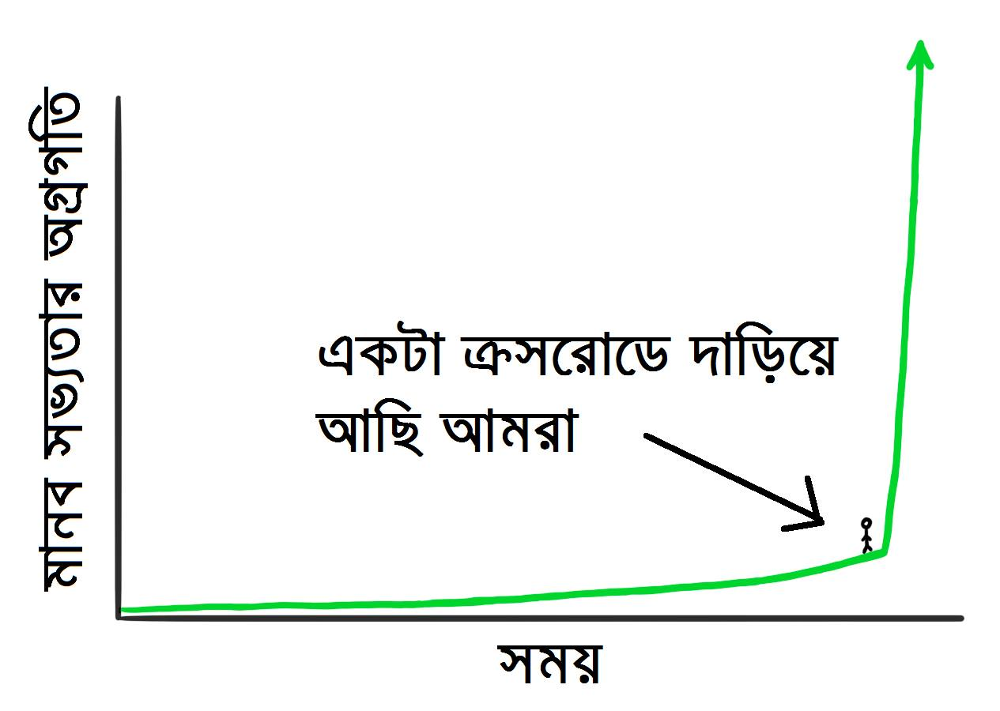
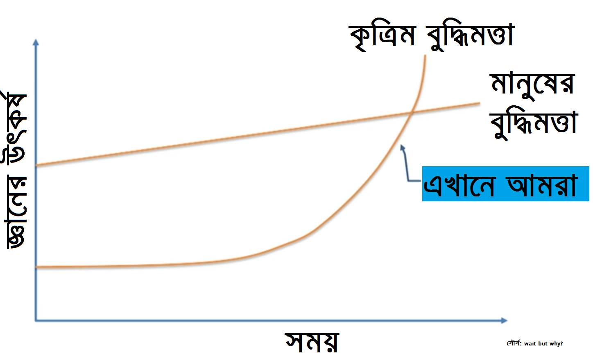
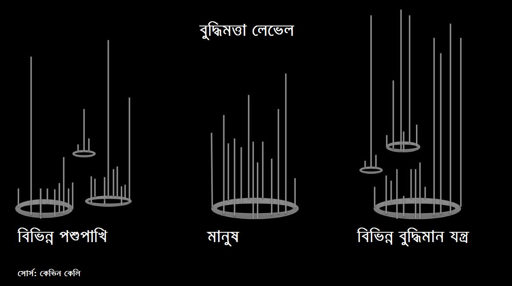

# ১.৭. আর্টিফিসিয়াল ইন্টেলিজেন্স - মেশিন লার্নিংএর প্রসার

> Just as eating contrary to the inclination is injurious to the health, so study without desire spoils the memory, and it retains nothing that it takes in.
>
> – Leonardo da Vinci

আর্টিফিসিয়াল ইন্টেলিজেন্স মানে কৃত্তিম বুদ্ধিমত্ত্বার একটা ছোট্ট অংশ হচ্ছে মেশিন লার্নিং। একটা সাবসেট। কৃত্তিম বুদ্ধিমত্ত্বার যে অংশটুকু যন্ত্রকে কানেক্ট করতে হয়, সেখানে চলে আসে ওই মেশিনকে শেখানোর কাজ। মেশিনকে শেখাবো কিভাবে? আগেই বলেছি - তার অভিজ্ঞতা দিয়ে। আর তার অভিজ্ঞতা হচ্ছে পুরানো মানে "লিগেসি" ডাটা।

তবে এটা ঠিক যে - একটা ক্রসরোডে দাড়িয়ে আমরা। সামনের ২০ বছরে যা উন্নতি হবে, তা ভাবতেই পারছিনা আমরা। এমুহুর্তে। চতুর্থ ইন্ডাস্ট্রিয়াল রেভ্যুলুশন নিয়ে আসবে 'আর্টিফিশিয়াল ইন্টেলিজেন্স'। ধারণা করা হয় মানুষ আছে পৃথিবীতে ২.৮ মিলিয়ন বছর আগে থেকে। ওই সময় থেকে আজ পর্যন্ত উন্নতি হয়েছে যা, তার দ্বিগুণেরও বেশি হবে এই ২০ বছরে! আসছি সামনেই।

অনেকে বলতে পারেন, আমরা এখন কোথায়? মানে - কৃত্রিম বুদ্ধিমত্তায়? আমি যা দেখেছি তাতে মানুষের মতো জিনিসপত্র এখান থেকে ওখানে নেয়া, অনেকটা আমাদের মতো করে ওঠানো নামানো, হেঁটে জিনিস নামাতে পারে এখন যন্ত্র। বুদ্ধিমত্তায় এখনো কিছুটা পাখির মতো। মানে, এটা নিয়ে আস, ওটা লাল, গরম মানে ধরবে না বললে বোঝে সে। এখনকার গতিতে এগোলে ২০৪০য়ে মানুষের মতো বুদ্ধি ধরবে যন্ত্র। প্রযুক্তির গতি বাড়লে ২০৩৫য়ে।  
**ছবি: আমরা দাঁড়িয়ে আছি একটা ক্রসরোডে**

আমার ধারণা, জ্ঞানের 'ডিফিউশন' আসে প্রিন্টিং প্রেস আবিস্কারের পর থেকে। ১৪৪০য়ের পর থেমে থাকেনি সময়। বাস্প ইঞ্জিন মানুষকে দেয় কৃত্তিম শক্তি, অনেক অনেক বেশি হর্স পাওয়ার। তার আগে ওই ঘোড়াই ছিল ভরসা। এলো তেলের ইঞ্জিন। কৃত্রিম সুর্যের মতো ক্ষমতা নিয়ে এলো বিদ্যুৎ। পেছনে তাকায়নি মানুষ। ইন্ডাস্ট্রিয়াল রেভল্যুশনে মানুষ এগিয়েছে যন্ত্র দিয়ে। তবে জ্ঞানে নয়। প্রযুক্তি বাড়ে 'এক্সপোনেনশিয়াল' মানে গুনিতক গতিতে, বাকি সব 'লিনিয়ার' গতিতে। যেমন শস্য উত্পাদনে। মুরের তত্ত্বের হিসেবে প্রতি ১৮ থেকে ২৪ মাসে দ্বিগুন হয় যন্ত্রের ক্ষমতা। এখন মুরের তত্ত্বও ফেল। সেটা কমে এসেছে অনেক। তাকিয়ে আছি ওই দিনের আশায়, যখন মানুষকে সাহায্য করবে যন্ত্র - মানুষের মতো করে।**ছবি: মানুষের পাশাপাশি কৃত্রিম বুদ্ধিমত্তার উত্থান**

স্কেলে ফেললে কি হয় দেখি বরং। সবার বুদ্ধিমত্তাকে। আমাদের ধারণা, পশুপাখির বুদ্ধিমত্তা এখনো প্রিমিটিভ লেভেলে। শিম্পাঞ্জির বুদ্ধি আমাদের কিছুটা কাছাকাছি। তারপর আমরা। মানে, আম জনতা। তারপর আইনস্টাইন অথবা ওই লেভেলের আমাদের বিজ্ঞানীরা। আসলে কি তাই? মানুষের বুদ্ধিমত্তা কি ওখানেই আটকানো? আমাদের অনেকেই অনেক স্ট্রিটস্মার্ট। অনেকে মনে রাখেন অনেক দিন - অনেক জিনিসপত্র।  
কেউ কেউ ইমোশনালি ইন্টেলিজেন্ট। আমার এক বন্ধু আছে 'রিজনিং'য়ে এক্সপার্ট! আরেকজন তুখোড় 'ডিডাকশনে'। একেবারে বসম্যান! তাহলে কি হবে এখন?

আমাদের বুদ্ধিমত্তার স্কেল নিয়ে যা বুঝি - সেখানেই আছে বড় ঝামেলা। বুদ্ধিমত্তার স্কেল কিন্তু এক ডাইমেনশনের নয়। অনেকটা গানের নোটের মতো। হাজারো ইনস্ট্রুমেন্ট, গলা, আর ব্যাকআপ ভোকালিস্ট না হলে হয় না পুরো গান। তেমনি, দরকারি সবধরনের জ্ঞান না থাকলে বুদ্ধিমত্তা অপূর্ন।

আমি না হতে পারি আইনস্টাইন, মানে বিজ্ঞানে তবে ‘ইমোশনাল ইন্টেলিজেন্স’ লেভেলে তো কম নেই। ধরে নিন, আমি কিছু কিছু জিনিসে ভালো হব অনেকের চেয়ে। আবার অন্যেরা ভালো হবে অনেক অন্য জিনিসে। একেক মানুষের একেক দিকে জ্ঞানের লেভেল বেশি। মানুষের মাথা ভর্তি কিন্তু হাজারো জিনিস দিয়ে।  
**ছবি: সবার বুদ্ধিমত্তার লেভেল**

মানুষ যে সব কিছুতেই স্মার্ট সেটাই বা বললো কে? একটা কাঠবিড়াল কয়টা বাদাম পুরো মাঠের কোথায় কোথায় রেখেছে সেটা মনে রাখে মানুষ থেকে ভালো। হাতি তো ভোলে না কিছুই। আবার কিছু মানুষের স্মৃতি গোল্ডফিস থেকেও খারাপ। কিছু কুকুর তার মনিবকে চেনে তার বউ থেকে বেশি। পশুপাখি আগেভাগেই বলতে পারে প্রাকৃতিক বিপদের কথা।

যন্ত্রের কথা বলি তাহলে। সামান্য ক্যালকুলেটর মানুষকে ছাড়িয়েছে তার বুদ্ধিমত্তায়। তাও সেটা অনেকদিন আগে। হ্যাঁ, শুধু অংকে। জিপিএস’য়ের বুদ্ধিমত্তা ভালো ন্যাভিগেশনে। গুগল মানুষ থেকে অনেক ভালো - লঙ টার্ম মেমরিতে। যন্ত্র অনেক ভালো, তবে একেকটা ফিল্ডে। মানে, বুদ্ধিমত্তা অনেক অনেক ডাইমেনশনের। দেখুন ছবিটা। একেকটা জিনিসের বুদ্ধিমত্তা একেক দিকে, অথবা অনেক কটা বুদ্ধিমত্তা নিয়ে একেকটা প্রাণী। অথবা একেকটা যন্ত্র। আপনার স্মার্টফোন ভালো অনেককিছুতে। মানুষের চেয়ে।

তাহলে যন্ত্র কবে ভালো হবে সবদিকে? এই মানুষের চেয়ে? মনে আছে ইলেকট্রিক গ্রিডের কথা? আপনার বাসা ততোটুকুই নেয় যতোটুকু দরকার। কৃত্রিম বুদ্ধিমত্তাও আসবে গ্রিড দিয়ে। মানুষের থেকেও বেশি বুদ্ধিমত্তা নিয়ে। আপনি নিবেন যতোটুকু দরকার ততোটুকু। খোলাসা করি বরং।

আগে বাসায় ছিলো চাপকল। পানি তোলার জন্য। পরে এলো কৃত্রিম শক্তি। বিদ্যুৎ। গ্রিড থেকে। চাপকল হয়ে গেল পাম্প। এর পরে আসবে কৃত্রিম বুদ্ধিমত্তা। ওই গ্রিড থেকে। পাম্প হবে স্মার্ট পাম্প। দরকার মোতাবেক তুলবে পানি। মানুষের ইশারা ছাড়াই। অফিস থেকে আসার আগেই করবে গরম পানি। গোছল অথবা কফির জন্য। কৃত্রিম বুদ্ধিমত্তা গ্রিড কিছু আছে এখনি। ‘ক্লাউড’ নাম তার। গ্যাস, বিদ্যুতের মতো আমরা কিনবো কৃত্তিম বুদ্ধিমত্তা। যেভাবে কিনছি গুগলের স্পীচ টু টেক্সট বাংলা অ্যাপ্লিকেশন প্রোগ্রামিং ইন্টারফেস। প্রতি ১৫ সেকেন্ড করে। কথা বলি বাসায় - ভয়েস সিনথেসিস হচ্ছে কোন না কোন সার্ভারে।

