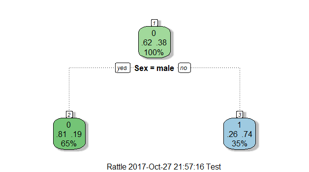

# ৭.৫. ডিসিশন ট্রি

## ডিসিশন ট্রি, কাহিনী কি?

| আমার প্রিয় চ্যাপ্টার |
| :--- |

এ পর্যন্ত আমরা যা যা করেছি - তার সব কিছুই করেছি হাতে কলমে, ছোট ছোট অংকের অনুপাত দিয়ে, অনেক ঝামেলা করে। প্রতিটা দরকারি ‘ভ্যারিয়েবল’ নিয়েছি আলাদা করে, সেগুলো থেকে খুঁচিয়ে খুঁচিয়ে বের করেছি এর ভেতরের সাবসেট আর তার অনুপাত। বড় ডাটাসেটগুলোকে ভাগ করে ফেলেছিলাম ছোট ছোট সাবসেটে। ছোট্ট সাবসেটগুলোতে দরকারি ডাটা চোখে পড়ে ভালোভাবে। মডেলের অ্যাক্যুরেসি আনার জন্য আমাদের এই ডাটাসেটকে ভাগ করতে হবে আরও ছোট ছোট সাবসেটে। তখন দেখা যাবে প্রতিটা ভ্যারিয়েবলের মধ্যে সম্পর্কটা কত নিবিড়। এই সম্পর্কগুলো আরো ভালো বোঝা যাবে যখন সাবসেটগুলো কথা বলবে নিজেদের ভেতর।

আসল কথা হচ্ছে আমরা অলস। আচ্ছা, আচ্ছা, মানছি আপনার কথা। ভুল বলেছি, আমি অলস। এই প্রতিটা ডাটাসেট ধরে ধরে ছোট ছোট সেটে ভাগ করে অনুপাতগুলো খুঁজে খুঁজে বের করার মত কর্মঠ আমি নই। আমি ক্লিক করব - আর হয়ে যাবে কাজ। সে কারণেই তো শিখছি মেশিন লার্নিং। ও বলে দেবে ডাটা দেখে - আমি তো বসম্যান। তাই হচ্ছে কিন্তু আমাদের ডাটা সাইন্স গ্যালাক্সিতে। অনেক চমৎকার জিনিস আসছে। তবে, বেসিক না জানলে কিছুই করা যাবে না এখানে।

তাই শুরুতেই খুবই সাধারণ এবং আমার প্রিয় একটা অ্যালগরিদম নিয়ে কাজ করব এখানে। আমি নই, যারা মেশিন লার্নিংয়ে নতুন বা পুরাতন সবাই শুরু করে এই ‘অ্যালগো’ দিয়ে। এটা আসলে অ্যালগরিদম নয় বরং সিদ্ধান্ত নেওয়ার একটা ডিসিশন ট্রি। শুধু মেশিন লার্নিং নয় সব কিছুতেই লাগে এই সিদ্ধান্ত গাছ বা ডিসিশন ট্রি। ভাবুন, আমরা যে কোনো কাজ করতে গেলে মনে মনে একটা “ট্রি” এঁকে ফেলি। মানে, এদিকে যাবো না ওদিক যাবো। কোনটা সুবিধা হবে? ব্যাপারটা এরকম যে আমরা যদি কোনো সিদ্ধান্ত নিতে চাই, তাহলে কোনো একটা ইনপুটের ওপর ভিত্তি করে দরকারি ফ্লো-চার্টের ডানে অথবা বামে যাই।

মনে আছে ছোটবেলার কথা? নিজের ছোটবেলায় এমন কোন জিনিস নেই - যেটা আমি ভাঙ্গিনি। ভাঙা বলা ভুল হবে - আমি খুলেছি। খুলতে তো আর সমস্যা নেই। বাসার বাবা মা চাকুরে, স্কুল থেকে এসেই এই কাজ। ক্যাডেট কলেজের ছুটি থাকলে তো পুরো বাসা আমার। আসলে - সবসময় দেখতে চেয়েছি কি জিনিস আছে ওর মধ্যে? যন্ত্রপাতি দেখলেই সেটা খুলে আবার জুড়ে দেওয়া ছিল আমার বড় কাজ। খুলে আবার জোড়া দেবার পর যখন যন্ত্রটা চলত না, তখন নিয়ে বসতাম ওই যন্ত্রের বিশাল বিশাল ম্যানুয়াল। ম্যানুয়াল পড়তে পড়তে মুখস্থ হয়ে গিয়েছিল ওদের ভেতরের “ফ্লোচার্ট”। ধরুন টিভির কথা। "সলিড গোল্ড" ঠিক মতো আসেনা।টিভিটা খুলে আবার জুড়েছি। ইন্টারনাল লাইনের সমস্যা দেখতে। মাঝখান দিয়ে জমা হলো কয়েকটা পকেট "স্ক্রু"। সমস্যা ১: ছবি আসছে না টিভিতে। করনীয় কি?

শুরু হলো ফ্লোচার্টের গল্প। পাওয়ার আউটলেটে লাগান আপনার টিভির তার। ছবি এসেছে? “হ্যাঁ” হলে ডান দিকে যান, “না” হলে বা দিকে যান। বাঁ দিকে কি? নতুন প্রশ্ন। পাওয়ার বাটন চালু করা আছে কিনা? \(আমরা ম্যানুয়াল যুগের মানুষ তো - তাই তখন সবকিছুই চেপেচুপে চালাতে হতো\)। এর উত্তর না' হলে, ডান দিকে যান। চাপ দিন সেই পাওয়ার বাটন। এর আবার উত্তর “হ্যাঁ” হলে, বাঁ দিকে যান। আবার প্রশ্ন। চ্যানেল বক্স এ কোন চ্যানেল বাটন চাপ দেয়া আছে কিনা? “হ্যাঁ” হলে ডান - না হলে বাম দিকে দেখুন। সেই ওয়ার্ক ফ্লো চার্ট কনসাল্ট করতে করতেই এসেছি এতোটা বছর। বেশিরভাগ সময়, সবকিছু চেক করেও চালু হতোনা বাসার টিভি। তখন বাকি থাকতো “মার” নামের একটা জিনিস।

**ছবি: সিদ্ধান্ত নেবার গাছপালা, ডিসিশন ট্রি**

মনে করুন - একটা গাছেরই কথা। আমরা যখন একটা গাছের ওপরে ওঠার চেষ্টা করি, প্রথমেই ধরি ওই গাছের গুঁড়িটাকে। গুঁড়ি শেষে আমাদের সামনে পড়ে গাছের কয়েকটা কান্ড। কান্ড বেয়ে ওপরে উঠলে সামনে পড়ে সেই কান্ডের শাখা প্রশাখা। আমাদের সিদ্ধান্ত সেরকম কিছুটা। প্রথমে আসে বড় সিদ্ধান্ত, তারপরে আসতে থাকে মাঝারি সিদ্ধান্ত, এরপর ছোট ছোট সিদ্ধান্ত। মানে "ন্যারো ডাউন" হতে থাকে আমাদের কাজ। গাছটাকে যদি উল্টো করে ধরি, তাহলে সিদ্ধান্তের শেষ সীমানায় পৌঁছাতে গেলে ‘নেভিগেট’ করতে হবে সেই গুড়ি দিয়ে - শুরুতে। তখন গুঁড়ির পরে আসবে কান্ড, তারপর সেগুলোর ছোট ছোট শাখা প্রশাখা।

চলুন ব্যাপারটাকে হিসেব করি টাইটানিকের ডাটাসেট নিয়ে। “train” ডাটাসেট নিয়ে কি করেছিলাম প্রথমে? বের করতে চেষ্টা করেছিলাম কে যাত্রীদের মধ্যে ঠিক ঠিক বেঁচে আর মারা গিয়েছিলেন, তাইনা? সেটাই হচ্ছে এই গাছের গুঁড়ি। এরপর এলো সেই বেঁচে যাওয়ার মধ্যে কতজন পুরুষ এবং মহিলা, তাইতো? সেগুলো হচ্ছে ওই গাছের কান্ড। নিচের একটা ছবি দেখি বরং। ছবিটা কিভাবে এলো সেটা নিয়ে মাথা ঘামাই পরে। পুরো ডাটাসেটে দেখা গেল মারা গিয়েছেন বেশিরভাগ। প্রতিটা মানুষের বাঁচা মরার একটা ভোটের হিসেব করলে বেশির ভাগ ভোট পড়বে শূন্যের ঘরে।

আপনারা তো জানেন আমাদের ফলাফল যেটা বাইনারি ক্লাসিফিকেশনে “০”। বাঁচা মানে ১, মরা মানে ০, তাইতো? ১০০% ডাটা সেটে বেঁচেছেন মাত্র ৩৮%। এর অর্থ হচ্ছে মারা গিয়েছেন প্রায় ৬২ শতাংশ। গুঁড়ি থেকে এবার আসি কাণ্ডে। তখন প্রশ্ন আসবে, আপনি পুরুষ না মহিলা? পুরুষ হলে ফলাফল আগের মত ‘০’। কারণ - পুরুষের ভোটের ফলাফল মৃত্যুর ঘরে বেশি। ওই মোট ১০০% এর ৬৫% পুরুষ প্যাসেঞ্জারের মাত্র ১৯% বেঁচেছেন। বেশি ঝামেলা লাগছে? ব্যাপারটা না বুঝলে আবার দেখুন ছবিটা। আমরা দুই নম্বর ঘরের কথা বলছি। নিচের ছবির ১ নম্বর ঘর কথা বলেছে কে বেঁচে গিয়েছিলেন আর কে মারা গেছেন। সেখানেও ভোটের সংখ্যায় “০” বেশি। দুই নম্বর ঘরেও ভোটের সংখ্যা “০” বেশি যেহেতু সবাই পুরুষ। তিন নম্বর ঘর - ২ নম্বর ঘরের পুরোপুরি উল্টো। এখানে ভোট পড়েছে “১” এ বেশি। মোট ১০০% এর ৩৫ শতাংশ মহিলাদের মধ্যে ৭৩% মহিলারাই বেঁচে গেছেন। এজন্য এখানকার ভোটের ঘর “১” দিয়ে পূর্ণ।

**ছবি: আমাদের ডিসিশন ট্রি - টাইটানিক ডাটাসেটের, শুধুমাত্র প্রথম অংশটুকু**

বুঝলাম, বোঝেননি কিছু। চলুন ফিরে যাই "আর" ষ্টুডিওতে।

এই যে বার বার সিদ্ধান্ত পার্টিশন করছি ডাটার অনুপাতের ওপর - এটাই কিন্তু একটা "রিকার্সিভ পার্টিশনিং" মেথড। এটা পেয়েছি আমরা ১৯৮৪ সালে - CART হিসেবে। গুগল করলেই বুঝবেন কি সাংঘাতিক জিনিস এটা। রিকার্সিভ পার্টিশনিং হচ্ছে ডাটা মাইনিংএর একটা ফান্ডামেন্টাল টুল। আপনার ডাটাসেটকে ঠিকমতো এক্সপ্লোর করতে লাগে এই জিনিস। ডাটা স্ট্রাকচার ধরে সেটার "ক্লাসিফিকেশন" যাকে আমরা বলছি ক্যাটেগরাইজেশন - আর কন্টিনিউয়াস ভ্যালু ধরে তার "রিগ্রেশন" ট্রি বের করতে দরকার আমাদের "রিকার্সিভ পার্টিশনিং" মেথড। যতো গল্প দিয়েছি শুরুতে - সবই CART। এই পরিসংখ্যানের জেনারেলাইজড লিনিয়ার মডেলের বিকল্প হিসেবে এসেছে এই রিকার্সিভ পার্টিশনিং ট্রি। আর এর প্যাকেজটার নাম হচ্ছে rpart\(\) যা ফাংশন হিসেবে চলে। এখানে মাথা খারাপ করা চলবে না - না বুঝলে আমাকে বলুন আমি বলবো হাজারো বার নতুন গল্প দিয়ে।

## আবারো ভিজ্যুয়ালাইজেশন, দেখাতেই বিশ্বাস

ঝামেলা চুকিয়ে ফেলি কিছু প্যাকেজ নিয়ে একসাথে। শুরুতে ইনস্টল করে নেই কিছু প্যাকেজ। rattle আর rpart.plot। ওমা, প্লট করতে হবে না? ভিজ্যুয়ালাইজেশন যে দরকার! একটু বসতে হবে আপনাকে। কিছু ডিপেন্ডেন্সি প্যাকেজও ইনস্টল হবে এক সাথে। ভার্সন কনফ্লিক্ট হলে gtk+ প্যাকেজ ইনস্টল হতে চাইবে এর সাথে।

> install.packages\('rattle'\)
>
> install.packages\('rpart.plot'\)
>
> install.packages\('RColorBrewer'\)

শুরুতে লোড করি rpart\(\) লাইব্রেরিকে।

> library\(rpart\)
>
> library\(rattle\)
>
> library\(rpart.plot\)
>
> library\(RColorBrewer\)

প্রথমেই তৈরি করি একটা জেন্ডার মডেল। ভ্যারিয়েবল হিসেবে নেই শুধুমাত্র Sex, আগের ছবি কিভাবে এসেছে সেটা বোঝানোর জন্য। পরের লাইনটা দরকার বুঝতে। ছবিতে।

> mytree1 &lt;- rpart\(Survived ~ Sex, data=train, method="class"\)
>
> fancyRpartPlot\(mytree1\)

**ছবি: আমাদের ডিসিশন ট্রি - টাইটানিক ডাটাসেট ১, ২ আর ৩ নম্বর ঘর**

পরের মডেলে ভ্যারিয়েবল হিসেবে নেই বয়স আর ক্লাস \(Pclass\)কে। মাত্র দুটো ভ্যারিয়েবলকে। ভেতরে বোঝার সুবিধার্থে।

mytree1 &lt;- rpart\(Survived ~ Sex, data=train, method="class"\)

fancyRpartPlot\(mytree1\)

আচ্ছা, পরের মডেলে বয়স আর ক্লাস \(Pclass\)কে নিয়ে প্লট করতে পারবেন কি?

## ব্যবহৃত গিটহাব স্ক্রিপ্ট \(অনলাইন\)

[https://github.com/raqueeb/mltraining/blob/master/ML-workbook/decision-tree.R](https://github.com/raqueeb/mltraining/blob/master/ML-workbook/decision-tree.R)

