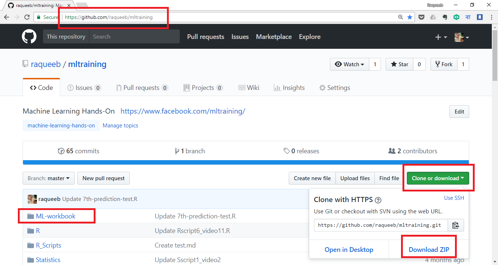

# ৫.৪. প্রজেক্টের গিটহাব স্ক্রিপ্ট

গিটহাব হচ্ছে আজকালের "রিজ্যুমে"। মানে - সবাই তাদের কাজ রাখে এখানে। রাখবো আমরাও। ধরুন, আপনি একজন “এইচআর” ম্যানেজার। কোম্পানির জন্য ভালো প্রোগ্রামিং জানা ছেলে-মেয়েদের ‘হায়ার’ করতে চাচ্ছেন আপনি। কিভাবে সিলেক্ট করবেন উনাদের? সিভি দেখে?

মনে হয় না। তাও আবার এ যুগে। কারণ, যাদেরকে আপনি ডাকবেন তাদের দক্ষতা জানবেন কিভাবে? সহজ রাস্তা হচ্ছে “গিটহাব”। যেখানে সবাই তাদের কোডগুলো রাখে আপলোড করে। প্রোগ্রামিংয়ের মহারথী থেকে আমাদের মতো বুড়োরা সবাই তাদের কোড রাখে ওখানে। কাজের সুবিধার্থে। এদিকে - যাদেরকে ডাকবেন তাদের কয়েকটা “কোড” দেখলেই বুঝবেন তাকে আপনি ডাকবেন কি না। কাজ সহজ হয়ে এসেছে এই যুগে।

ফিরে আসি আমাদের গিটহাব পাতায়। প্রতিটা স্ক্রিপ্ট চ্যাপ্টার হিসেবে দেয়া আছে এখানে। পুরোটা “জিপ” হিসেবে ডাউনলোড করতে লাগতে পারে কয়েক সেকেন্ড। কয়েক কিলোবাইট হতে পারে বড়জোড়। আপনাদের কাজ একটাই। স্ক্রিপ্টগুলো “জিপ” হিসেবে ডাউনলোড করবেন আর বুঝে বুঝে চালাবেন একেকটা স্ক্রিপ্ট। এটা ঠিক যে কাজ করা স্ক্রিপ্টের ওপর কাজ করা সোজা। শেখাও সোজা। স্ক্রিপ্টগুলো প্রিন্ট করে দেয়া যেতো তবে সেটার কার্যকারিতা নিয়ে যথেষ্ট সন্দিহান আমি নিজেই। এতো বড় বড় স্ক্রিপ্ট নতুন করে টাইপ করে কাজ করার কোন অর্থ হয়না। এর ওপর ভুল হবে হাজারো। একটা ঝামেলা হলে আপনার মাথার চুল টানাতে চাচ্ছি না কোন ভাবেই। এছাড়া স্ক্রিপ্ট ছাপাতেই চলে চলে যাবে অর্ধেক বই!

আমাদের গিটহাবের লিংক হচ্ছে [https://github.com/raqueeb/mltraining](https://github.com/raqueeb/mltraining)

নিচের ছবি দেখুন।

**ছবি: কিভাবে নামাতে হবে সব স্ক্রিপ্ট**

